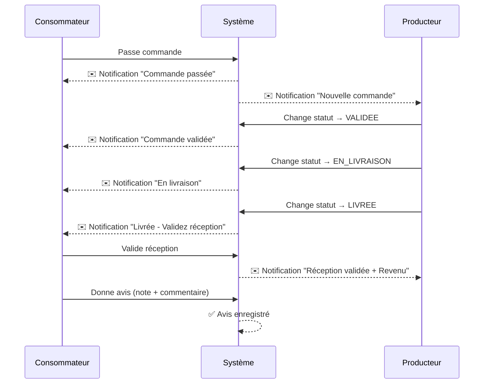
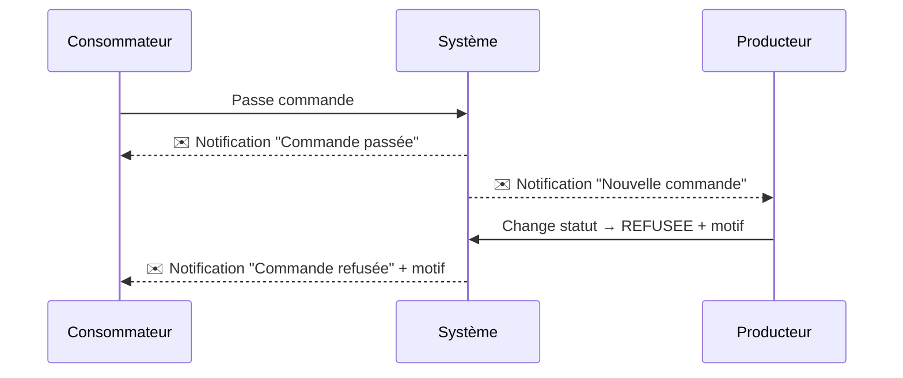

# 🎉 Nouvelles Fonctionnalités - SuguConnect

## ✅ Fonctionnalités Implémentées

### 1. 📸 Photo et Nom de Ferme pour les Producteurs

**Entité Producteur mise à jour :**
- `nomFerme` : Nom de la ferme du producteur
- `photoUrl` : URL de la photo de profil du producteur

**Endpoint d'inscription/modification :**
```json
POST /producteur/inscription
{
  "nom": "Diallo",
  "prenom": "Amadou",
  "telephone": "77123456",
  "email": "amadou@ferme.com",
  "localisation": "Conakry",
  "motDePasse": "password123",
  "description": "Producteur de fruits biologiques",
  "nomFerme": "Ferme Bio d'Amadou"  // ✨ NOUVEAU
}
```

**Pour ajouter la photo :**
1. Utiliser l'endpoint `/files/upload` pour uploader la photo
2. Récupérer l'URL retournée
3. Mettre à jour le producteur avec cette URL

---

### 2. 🔔 Notifications Automatiques

#### 📦 Pour les Commandes

**Consommateur reçoit des notifications pour :**
- ✅ **Commande passée** - Confirmation immédiate
- ✅ **Commande validée** - Le producteur a accepté
- ✅ **Commande refusée** - Avec motif de refus
- ✅ **Commande en livraison** - Produits en route
- ✅ **Commande livrée** - Invitation à valider la réception

**Producteur reçoit des notifications pour :**
- ✅ **Nouvelle commande** - Dès qu'un client commande
- ✅ **Validation de réception** - Le client confirme avoir reçu + Revenu généré

#### 📬 Pour la Validation de Compte

**Producteur reçoit :**
- ✅ **Compte validé** - Son compte est accepté par l'admin
- ✅ **Compte refusé** - Avec motif de refus

---

### 3. ⭐ Système d'Avis et Évaluations

**Nouvelle entité : `Avis`**
- Note de 1 à 5 étoiles
- Commentaire optionnel
- Associé à une commande
- Validation automatique (ou modération par admin)

**Workflow complet :**
1. Client passe commande → **Notification envoyée**
2. Producteur valide → **Notification envoyée**
3. Producteur marque comme "LIVREE" → **Notification envoyée**
4. Client valide la réception → **Notification envoyée au producteur**
5. Client donne un avis → **Avis enregistré**

**Endpoints Avis :**

```bash
# Créer un avis (après validation de réception)
POST /avis/commande/{commandeId}?consommateurId=1&note=5&commentaire=Excellent

# Voir les avis d'un producteur
GET /avis/producteur/{producteurId}

# Obtenir la moyenne des notes
GET /avis/producteur/{producteurId}/moyenne

# Voir l'avis d'une commande
GET /avis/commande/{commandeId}
```

---

### 4. ✅ Validation de Réception par le Consommateur

**Entité Commande mise à jour :**
- `receptionValidee` : boolean (false par défaut)
- `dateReceptionValidee` : LocalDate

**Endpoint de validation :**
```bash
POST /consommateur/commande/{commandeId}/valider-reception?consommateurId=1
```

**Règles de validation :**
- ✅ La commande doit être au statut "LIVREE"
- ✅ Le consommateur doit être le propriétaire de la commande
- ✅ Ne peut être validée qu'une seule fois
- ✅ Notification automatique envoyée au producteur

---

### 5. 🔄 Gestion du Statut de Commande par le Producteur

**Endpoint de changement de statut :**
```bash
PUT /producteur/commande/{commandeId}/statut
?producteurId=5
&nouveauStatut=LIVREE
&motifRejet=Stock%20insuffisant  # Optionnel, requis si REFUSEE
```

**Statuts possibles :**
- `VALIDEE` - Producteur accepte la commande
- `REFUSEE` - Producteur refuse (motif obligatoire)
- `EN_LIVRAISON` - Commande en cours de livraison
- `LIVREE` - Commande livrée (seul le producteur peut mettre ce statut)

**Sécurité :**
- ✅ Seul le producteur propriétaire des produits peut changer le statut
- ✅ Notification automatique au consommateur à chaque changement

---

## 🎯 Scénarios d'Utilisation Complets

### Scénario 1 : Commande Acceptée et Livrée



### Scénario 2 : Commande Refusée



---

## 📊 Nouvelles Tables en Base de Données

### Table `avis`
```sql
CREATE TABLE avis (
    id INT PRIMARY KEY AUTO_INCREMENT,
    commande_id INT,
    consommateur_id INT,
    producteur_id INT,
    note INT CHECK (note BETWEEN 1 AND 5),
    commentaire VARCHAR(1000),
    date_avis DATETIME,
    valide BOOLEAN DEFAULT FALSE,
    FOREIGN KEY (commande_id) REFERENCES commande(id_commande),
    FOREIGN KEY (consommateur_id) REFERENCES consommateur(id),
    FOREIGN KEY (producteur_id) REFERENCES producteur(id)
);
```

### Modifications `producteur`
```sql
ALTER TABLE producteur 
ADD COLUMN nom_ferme VARCHAR(255),
ADD COLUMN photo_url VARCHAR(500);
```

### Modifications `commande`
```sql
ALTER TABLE commande 
ADD COLUMN reception_validee BOOLEAN DEFAULT FALSE,
ADD COLUMN date_reception_validee DATE;
```

---

## 🧪 Tests dans Swagger

### 1. Tester le Workflow Complet

#### Étape 1 : Login Consommateur
```
POST /auth/login/consommateur
{
  "telephone": "76543210",
  "motDePasse": "password123"
}
```
→ Copier le token

#### Étape 2 : Passer une Commande
```
POST /consommateur/1/commande?modePaiement=ESPECES
```
→ Noter l'ID de la commande (ex: 15)
→ Vérifier la notification reçue : GET /notifications/non-lues?utilisateurId=1

#### Étape 3 : Login Producteur
```
POST /auth/login/producteur
{
  "telephone": "77123456",
  "motDePasse": "password123"
}
```
→ Copier le nouveau token
→ Vérifier la notification : GET /notifications/non-lues?utilisateurId=5

#### Étape 4 : Valider la Commande
```
PUT /producteur/commande/15/statut?producteurId=5&nouveauStatut=VALIDEE
```

#### Étape 5 : Marquer comme Livrée
```
PUT /producteur/commande/15/statut?producteurId=5&nouveauStatut=LIVREE
```

#### Étape 6 : Consommateur Valide la Réception
```
POST /consommateur/commande/15/valider-reception?consommateurId=1
```

#### Étape 7 : Consommateur Donne un Avis
```
POST /avis/commande/15?consommateurId=1&note=5&commentaire=Excellente qualité!
```

#### Étape 8 : Voir les Avis du Producteur
```
GET /avis/producteur/5
GET /avis/producteur/5/moyenne
```

---

## 📱 Intégration Frontend

### Exemple JavaScript - Valider Réception

```javascript
async function validerReception(commandeId, consommateurId, token) {
    const response = await fetch(
        `http://localhost:8080/suguconnect/consommateur/commande/${commandeId}/valider-reception?consommateurId=${consommateurId}`,
        {
            method: 'POST',
            headers: {
                'Authorization': `Bearer ${token}`
            }
        }
    );
    
    if (response.ok) {
        const commande = await response.json();
        console.log('Réception validée:', commande);
        // Afficher formulaire d'avis
        afficherFormulaireAvis(commandeId);
    }
}
```

### Exemple JavaScript - Donner un Avis

```javascript
async function donnerAvis(commandeId, consommateurId, note, commentaire, token) {
    const response = await fetch(
        `http://localhost:8080/suguconnect/avis/commande/${commandeId}?consommateurId=${consommateurId}&note=${note}&commentaire=${encodeURIComponent(commentaire)}`,
        {
            method: 'POST',
            headers: {
                'Authorization': `Bearer ${token}`
            }
        }
    );
    
    if (response.ok) {
        const avis = await response.json();
        console.log('Avis enregistré:', avis);
        alert('Merci pour votre avis !');
    }
}
```

### Exemple JavaScript - Changer Statut (Producteur)

```javascript
async function changerStatutCommande(commandeId, producteurId, nouveauStatut, token, motifRejet = null) {
    let url = `http://localhost:8080/suguconnect/producteur/commande/${commandeId}/statut?producteurId=${producteurId}&nouveauStatut=${nouveauStatut}`;
    
    if (motifRejet) {
        url += `&motifRejet=${encodeURIComponent(motifRejet)}`;
    }
    
    const response = await fetch(url, {
        method: 'PUT',
        headers: {
            'Authorization': `Bearer ${token}`
        }
    });
    
    if (response.ok) {
        const commande = await response.json();
        console.log('Statut mis à jour:', commande);
    }
}
```

---

## 🔐 Sécurité

### Règles Implémentées

1. **Validation Réception :**
   - ✅ Seul le consommateur propriétaire peut valider
   - ✅ Commande doit être au statut LIVREE
   - ✅ Validation unique (pas de double validation)

2. **Changement Statut :**
   - ✅ Seul le producteur propriétaire des produits peut changer le statut
   - ✅ Motif obligatoire si REFUSEE

3. **Avis :**
   - ✅ Avis possible uniquement après validation de réception
   - ✅ Un seul avis par commande
   - ✅ Note obligatoirement entre 1 et 5

---

## 🎉 Résumé

Toutes les fonctionnalités demandées ont été implémentées :

✅ Photo et nom de ferme pour les producteurs  
✅ Notifications automatiques à chaque étape de la commande  
✅ Seul le producteur peut marquer une commande comme "LIVREE"  
✅ Le consommateur peut valider la réception  
✅ Le consommateur peut donner un avis après validation  
✅ Système complet de notifications pour consommateurs et producteurs  

**Le système est maintenant complet et prêt à être testé ! 🚀**
