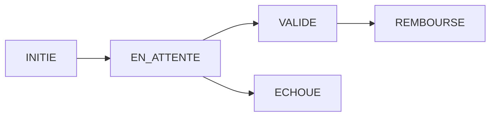
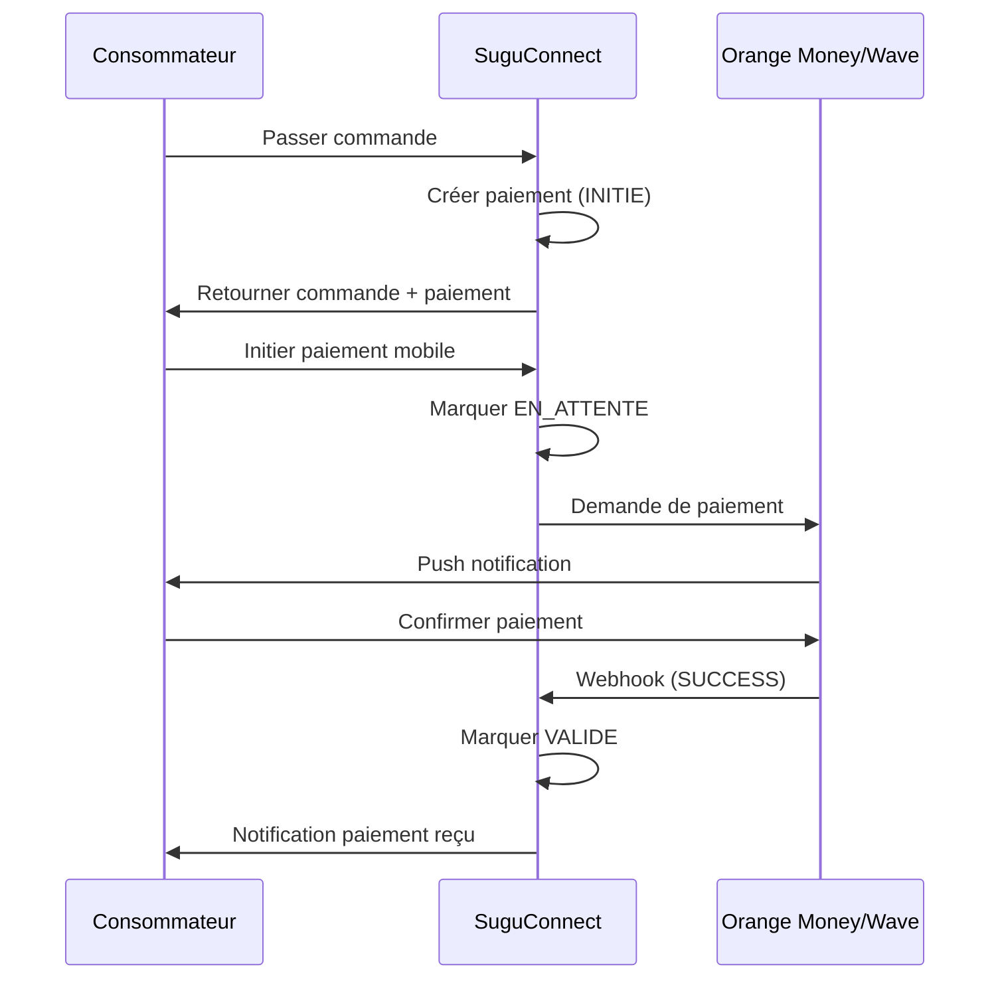
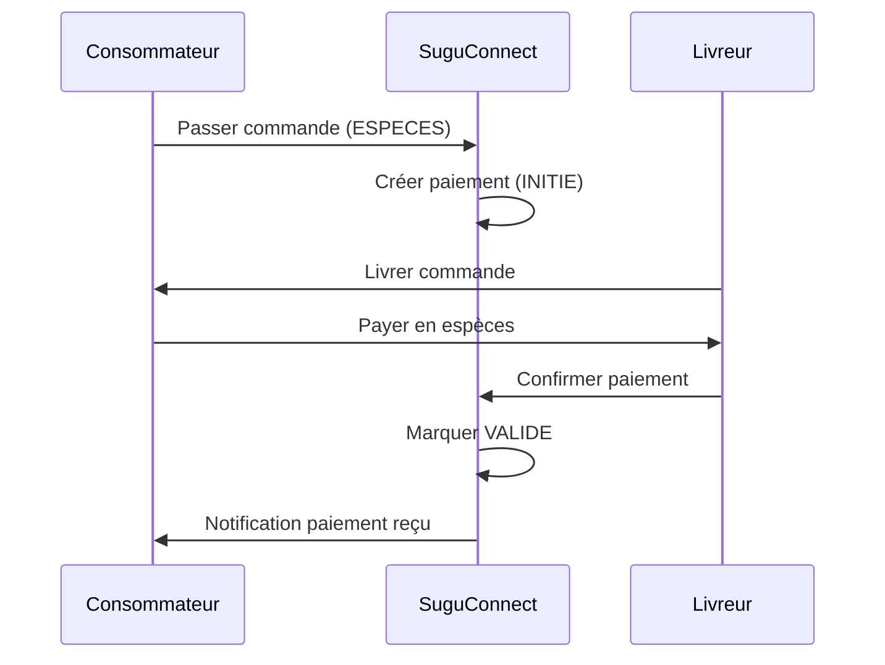

# 💳 Système de Paiement - SuguConnect

## 📅 Date: 22 Octobre 2025

---

## 🎯 Vue d'Ensemble

Le système de paiement de SuguConnect supporte **3 modes de paiement**:
1. **Orange Money** 🍊
2. **Wave** 🌊  
3. **Espèces** 💵

Le système gère automatiquement:
- ✅ Création du paiement lors de la commande
- ✅ Validation des paiements
- ✅ Gestion des échecs
- ✅ Remboursements
- ✅ Notifications automatiques

---

## 📊 États du Paiement (StatutPaiement)



| Statut | Description | Suivant |
|--------|-------------|---------|
| `INITIE` | Paiement créé automatiquement | `EN_ATTENTE` |
| `EN_ATTENTE` | En attente de confirmation | `VALIDE` ou `ECHOUE` |
| `VALIDE` | Paiement confirmé et validé | `REMBOURSE` (si besoin) |
| `ECHOUE` | Paiement échoué/annulé | - (final) |
| `REMBOURSE` | Paiement remboursé | - (final) |

---

## 🔄 Flux de Paiement

### **1. Paiement Orange Money / Wave**



### **2. Paiement Espèces**



---

## 🏗️ Architecture

### **Entité Paiement**

```java
@Entity
public class Paiement {
    private int idPaiement;
    private double montant;
    private LocalDate datePaiement;
    private ModePaiement methodePaiement;  // ORANGE_MONEY, WAVE, ESPECES
    private StatutPaiement statutPaiement; // INITIE, EN_ATTENTE, VALIDE, ECHOUE, REMBOURSE
    private Consommateur consommateur;
    private Commande commande;
}
```

### **Service Layer**

**PaiementService** - Responsabilités:
- ✅ CRUD des paiements
- ✅ Validation des paiements
- ✅ Gestion des échecs
- ✅ Remboursements
- ✅ Initiation paiements mobiles
- ✅ Traitement webhooks

---

## 📚 API Endpoints

### **1. Consulter les Paiements**

#### **GET /paiement**
Récupérer tous les paiements (Admin uniquement)

**Response 200**:
```json
[
  {
    "idPaiement": 1,
    "montant": 17500.0,
    "datePaiement": "2025-10-22",
    "methodePaiement": "ORANGE_MONEY",
    "statutPaiement": "VALIDE",
    "commande": {...}
  }
]
```

---

#### **GET /paiement/{id}**
Récupérer un paiement spécifique

**Response 200**:
```json
{
  "idPaiement": 1,
  "montant": 17500.0,
  "datePaiement": "2025-10-22",
  "methodePaiement": "ORANGE_MONEY",
  "statutPaiement": "VALIDE"
}
```

---

#### **GET /paiement/commande/{commandeId}**
Récupérer le paiement d'une commande

**Parameters**:
- `commandeId` (path) - ID de la commande

**Response 200**: Objet Paiement associé

---

### **2. Valider un Paiement**

#### **PUT /paiement/{id}/valider**
Valider un paiement manuellement (espèces, confirmation admin)

**Parameters**:
- `id` (path) - ID du paiement
- `referenceTransaction` (query, optionnel) - Référence externe

**Exemple**:
```http
PUT /paiement/1/valider?referenceTransaction=OM-123456789
```

**Response 200**:
```json
{
  "idPaiement": 1,
  "montant": 17500.0,
  "statutPaiement": "VALIDE",
  "datePaiement": "2025-10-22"
}
```

**Actions automatiques**:
- ✅ Change statut → `VALIDE`
- ✅ Envoie notification au consommateur
- ✅ Met à jour la date de paiement

---

### **3. Marquer comme Échoué**

#### **PUT /paiement/{id}/echouer**
Marquer un paiement comme échoué

**Parameters**:
- `id` (path) - ID du paiement
- `motifEchec` (query, required) - Raison de l'échec

**Exemple**:
```http
PUT /paiement/1/echouer?motifEchec=Fonds insuffisants
```

**Response 200**: Paiement avec statut `ECHOUE`

**Actions automatiques**:
- ✅ Change statut paiement → `ECHOUE`
- ✅ Change statut commande → `DECLINEE`
- ✅ Envoie notification au consommateur

---

### **4. Rembourser un Paiement**

#### **PUT /paiement/{id}/rembourser**
Effectuer un remboursement

**Parameters**:
- `id` (path) - ID du paiement
- `motifRemboursement` (query, required) - Raison du remboursement

**Exemple**:
```http
PUT /paiement/1/rembourser?motifRemboursement=Produit non disponible
```

**Response 200**: Paiement avec statut `REMBOURSE`

**Actions automatiques**:
- ✅ Change statut → `REMBOURSE`
- ✅ Envoie notification au consommateur
- ✅ TODO: Initier remboursement réel (Orange Money/Wave API)

**Validation**:
- ⚠️ Seul un paiement `VALIDE` peut être remboursé

---

### **5. Initier Paiement Mobile**

#### **POST /paiement/{id}/initier-mobile**
Initier un paiement Orange Money ou Wave

**Parameters**:
- `id` (path) - ID du paiement
- `numeroTelephone` (query, required) - Numéro pour le paiement

**Exemple**:
```http
POST /paiement/1/initier-mobile?numeroTelephone=771234567
```

**Response 200**:
```json
{
  "message": "Paiement de 17500.00 FCFA initié via ORANGE_MONEY au numéro 771234567. Veuillez composer *144# pour confirmer.",
  "statut": "EN_ATTENTE",
  "paiementId": "1"
}
```

**Actions automatiques**:
- ✅ Change statut → `EN_ATTENTE`
- ✅ TODO: Appel API Orange Money/Wave pour push notification

---

### **6. Webhook Paiement**

#### **POST /paiement/webhook**
Recevoir les notifications des fournisseurs de paiement

**Request Body**:
```json
{
  "reference": "OM-987654321",
  "status": "SUCCESS",
  "payment_id": "1"
}
```

**Statuts supportés**:
- `SUCCESS` ou `COMPLETED` → Marque comme `VALIDE`
- `FAILED` ou `CANCELLED` → Marque comme `ECHOUE`
- Autres → Reste `EN_ATTENTE`

**Response 200**: `"Webhook traité avec succès"`

**Actions automatiques**:
- ✅ Mise à jour automatique du statut
- ✅ Notifications envoyées selon le résultat

---

## 🔐 Sécurité

### **Contrôle d'Accès**

| Endpoint | ADMIN | PRODUCTEUR | CONSOMMATEUR |
|----------|-------|------------|--------------|
| `GET /paiement` | ✅ | ❌ | ❌ |
| `GET /paiement/{id}` | ✅ | ❌ | ✅ (si propriétaire) |
| `GET /paiement/commande/{id}` | ✅ | ✅ (si sa commande) | ✅ (si sa commande) |
| `PUT /paiement/{id}/valider` | ✅ | ✅ (espèces) | ❌ |
| `PUT /paiement/{id}/echouer` | ✅ | ❌ | ❌ |
| `PUT /paiement/{id}/rembourser` | ✅ | ❌ | ❌ |
| `POST /paiement/{id}/initier-mobile` | ✅ | ❌ | ✅ (si son paiement) |
| `POST /paiement/webhook` | 🔓 (public) | 🔓 | 🔓 |

**Note**: Le webhook doit être public pour recevoir les callbacks des fournisseurs de paiement.

---

## 📬 Notifications Automatiques

### **1. Paiement Validé**
```
Type: PAIEMENT_RECU
À: Consommateur
Message: "Votre paiement de 17500 FCFA pour la commande #1 a été reçu avec succès"
Lien: /commandes/1
```

### **2. Paiement Échoué**
```
Type: PAIEMENT_RECU (custom)
À: Consommateur
Message: "Le paiement de votre commande #1 a échoué. Raison: Fonds insuffisants"
Lien: /commandes/1
```

### **3. Remboursement Effectué**
```
Type: REMBOURSSEMENT_EFFECTUE
À: Consommateur
Message: "Votre remboursement de 17500 FCFA pour la commande #1 a été effectué"
Lien: /commandes/1
```

---

## 🧪 Scénarios de Test

### **Scénario 1: Paiement Orange Money Réussi**

```http
# 1. Passer une commande
POST /consommateur/1/commande?modePaiement=ORANGE_MONEY

# Réponse contient paiement.idPaiement = 1, statut = INITIE

# 2. Initier le paiement mobile
POST /paiement/1/initier-mobile?numeroTelephone=771234567

# Statut passe à EN_ATTENTE

# 3. Simuler webhook de confirmation
POST /paiement/webhook
{
  "reference": "OM-123456",
  "status": "SUCCESS",
  "payment_id": "1"
}

# Statut passe à VALIDE
# Notification envoyée au consommateur
```

---

### **Scénario 2: Paiement Espèces**

```http
# 1. Passer une commande
POST /consommateur/1/commande?modePaiement=ESPECES

# Paiement créé avec statut INITIE

# 2. Producteur/Livreur livre la commande
PUT /producteur/commande/1/statut?producteurId=2&nouveauStatut=LIVREE

# 3. Admin/Producteur valide le paiement après réception des espèces
PUT /paiement/1/valider

# Statut passe à VALIDE
# Notification envoyée au consommateur
```

---

### **Scénario 3: Paiement Échoué**

```http
# 1. Passer une commande
POST /consommateur/1/commande?modePaiement=WAVE

# 2. Initier le paiement
POST /paiement/1/initier-mobile?numeroTelephone=771234567

# 3. Client annule ou fonds insuffisants - Webhook échec
POST /paiement/webhook
{
  "reference": "WAVE-789",
  "status": "FAILED",
  "payment_id": "1"
}

# Statut paiement → ECHOUE
# Statut commande → DECLINEE
# Notification envoyée
```

---

### **Scénario 4: Remboursement**

```http
# 1. Commande livrée avec paiement validé
# statut paiement = VALIDE

# 2. Produit défectueux, admin rembourse
PUT /paiement/1/rembourser?motifRemboursement=Produit défectueux

# Statut passe à REMBOURSE
# Notification de remboursement envoyée
```

---

## 🔌 Intégration Orange Money / Wave

### **État Actuel: SIMULATION** ⚠️

Le système actuel **simule** les paiements mobiles:
- ✅ Initiation du paiement (statut `EN_ATTENTE`)
- ✅ Réception de webhook
- ✅ Mise à jour automatique du statut
- ⚠️ **Pas d'appel API réel** aux fournisseurs

### **Prochaine Étape: INTÉGRATION RÉELLE** 🚀

Pour une vraie intégration:

#### **Orange Money API**
```java
// Dans initierPaiementMobile()
// TODO: Remplacer par:
OrangeMoneyAPI api = new OrangeMoneyAPI(apiKey, apiSecret);
OrangeMoneyResponse response = api.initierPaiement(
    numeroTelephone,
    paiement.getMontant(),
    "Commande #" + paiement.getCommande().getIdCommande()
);

paiement.setReferenceExterne(response.getTransactionId());
```

#### **Wave API**
```java
// TODO: Implémenter intégration Wave
WaveAPI api = new WaveAPI(apiKey);
WaveResponse response = api.createPaymentRequest(
    numeroTelephone,
    paiement.getMontant(),
    callbackUrl
);
```

#### **Configuration Webhook**
```properties
# application.properties
paiement.orangemoney.api.url=https://api.orange.com/...
paiement.orangemoney.api.key=YOUR_API_KEY
paiement.orangemoney.webhook.secret=YOUR_WEBHOOK_SECRET

paiement.wave.api.url=https://api.wave.com/...
paiement.wave.api.key=YOUR_API_KEY
```

---

## 📊 Statistiques Paiements

### **Méthodes Disponibles**

Pour ajouter des statistiques:

```java
// Dans PaiementService
public Map<StatutPaiement, Long> getStatistiquesStatuts() {
    return paiementRepository.findAll().stream()
        .collect(Collectors.groupingBy(
            Paiement::getStatutPaiement,
            Collectors.counting()
        ));
}

public Map<ModePaiement, Double> getRevenuParMode() {
    return paiementRepository.findAll().stream()
        .filter(p -> p.getStatutPaiement() == StatutPaiement.VALIDE)
        .collect(Collectors.groupingBy(
            Paiement::getMethodePaiement,
            Collectors.summingDouble(Paiement::getMontant)
        ));
}
```

---

## ✅ Checklist Système de Paiement

### **Backend** ✅
- [x] Entité Paiement complète
- [x] PaiementService avec toutes les méthodes
- [x] PaiementController avec tous les endpoints
- [x] Création automatique lors de la commande
- [x] Gestion des statuts (INITIE → VALIDE/ECHOUE/REMBOURSE)
- [x] Notifications automatiques
- [x] Support Orange Money / Wave / Espèces
- [x] Système de webhook pour callbacks

### **À Implémenter** 📋
- [ ] Intégration réelle Orange Money API
- [ ] Intégration réelle Wave API
- [ ] Sécurisation webhook (signature HMAC)
- [ ] Retry automatique en cas d'échec
- [ ] Dashboard de statistiques
- [ ] Export des paiements (CSV, Excel)
- [ ] Réconciliation bancaire
- [ ] Tests unitaires du PaiementService

---

## 🎯 Résumé

### **Ce qui fonctionne MAINTENANT** ✅
1. ✅ **Création automatique** du paiement lors de la commande
2. ✅ **Validation manuelle** des paiements (espèces, admin)
3. ✅ **Gestion des échecs** avec notification
4. ✅ **Remboursements** avec notification
5. ✅ **Simulation paiements mobiles** (Orange Money/Wave)
6. ✅ **Webhook** pour mise à jour automatique
7. ✅ **Notifications automatiques** à chaque changement de statut

### **Modes de Paiement Supportés**
- 🍊 **Orange Money** - Initiation simulée + webhook
- 🌊 **Wave** - Initiation simulée + webhook
- 💵 **Espèces** - Validation manuelle

### **Workflow Complet**
```
Commande → Paiement (INITIE) → 
  ├─ Espèces → Validation manuelle → VALIDE
  ├─ Orange Money → Initiation → EN_ATTENTE → Webhook → VALIDE/ECHOUE
  └─ Wave → Initiation → EN_ATTENTE → Webhook → VALIDE/ECHOUE
```

---

**✨ Le système de paiement est maintenant COMPLET et FONCTIONNEL ! ✨**

**Date de création**: 22 Octobre 2025  
**Version**: 1.0 - Production Ready (Simulation)  
**Version cible**: 2.0 - Intégration API réelle Orange Money/Wave
